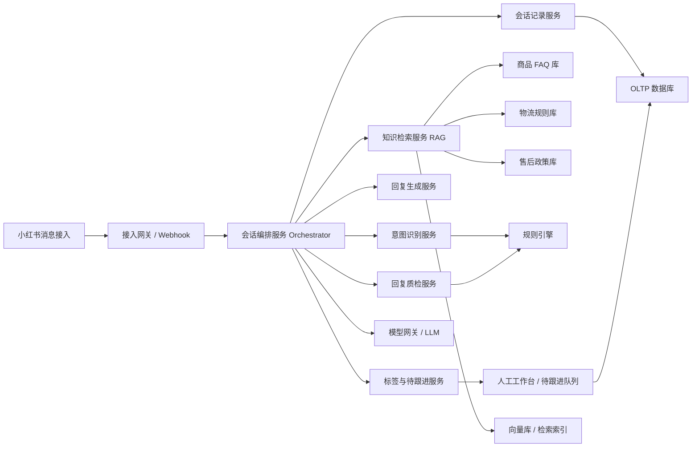
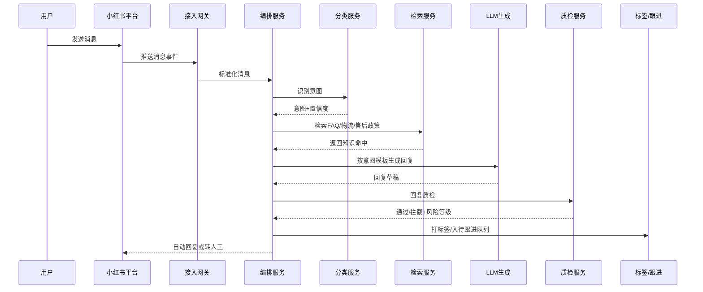
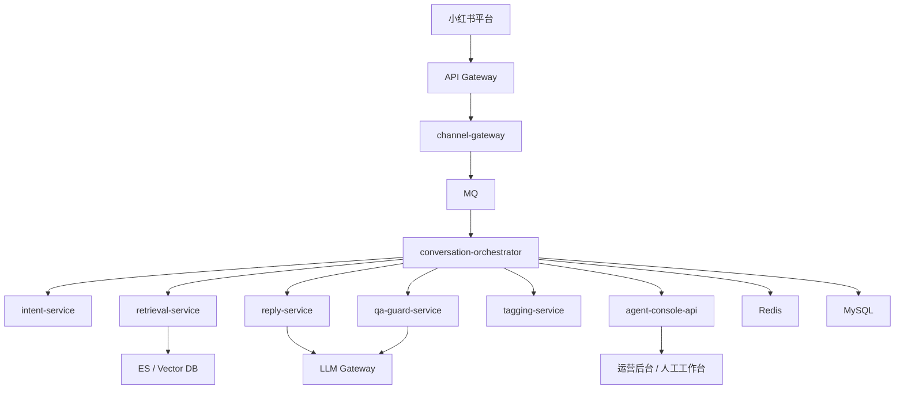

# 小红书商家客服 Agent 中台架构设计

## 1. 项目目标

建设一套面向小红书商家的客服 Agent 中台，覆盖以下核心能力：

- 消息分类：识别售前咨询、催发货、售后、退换货、价格咨询等意图。
- 知识库检索：优先检索商品 FAQ、物流规则、售后政策，再生成回复。
- 自动回复生成：基于意图、上下文、检索结果生成合规回复。
- 会话记录：沉淀消息、意图、知识命中、回复、人工介入记录。
- 质检与追踪：对回复进行风险审查，为高风险会话打标签并进入待跟进队列。

系统目标不是“直接替代人工”，而是建设“可控、可审计、可接管”的客服中台。

## 2. 设计原则

- 先检索、后生成：禁止模型脱离知识库直接回答售后政策、时效、承诺类问题。
- 分类驱动编排：不同意图走不同 Prompt、不同知识源、不同质检规则。
- 规则优先兜底：高风险场景优先使用规则拦截，再由模型补充表达。
- 全链路留痕：消息、知识命中、Prompt、模型输出、质检结果都可追溯。
- 人工可接管：命中高风险标签、低置信度、质检不通过时自动转人工/待跟进。

## 3. 总体架构



## 4. 分层设计

### 4.1 渠道接入层

职责：

- 接收小红书平台的会话消息、订单相关事件、物流状态事件。
- 标准化不同消息格式，统一转为内部事件。
- 做签名校验、幂等去重、消息重试。

建议组件：

- `channel-gateway`
- 消息队列：Kafka / RocketMQ / RabbitMQ

输入事件示例：

- 用户发来文本消息
- 用户发来商品咨询
- 订单状态变化
- 物流状态更新

### 4.2 Agent 编排层

职责：

- 串联意图识别、知识检索、回复生成、质检、标签、跟进。
- 根据不同意图选择不同 Prompt 模板和知识范围。
- 根据低置信度、高风险、人工接管规则决定是否自动回复。

建议组件：

- `conversation-orchestrator`
- `workflow-engine`，可选 Temporal / 自研状态机

核心能力：

- 会话级状态管理
- 多轮上下文截断与摘要
- 超时与失败重试
- 人工接管与恢复

### 4.3 意图识别层

目标意图：

- 售前咨询
- 催发货
- 售后
- 退换货
- 价格咨询
- 其他 / 无法识别

推荐方案：

- 一级规则分类：关键词、订单状态、物流节点、售后关键词先做粗分。
- 二级模型分类：使用轻量分类 Prompt 或小模型进行意图细分。
- 输出置信度：低于阈值进入“需人工确认”。

输出结构：

```json
{
  "intent": "催发货",
  "confidence": 0.93,
  "signals": ["订单已支付", "用户提到什么时候发货"],
  "needs_human": false
}
```

### 4.4 知识库检索层

知识源拆分：

- 商品 FAQ：材质、尺寸、颜色、使用方法、库存说明。
- 物流规则：发货时效、节假日影响、地区限制、物流异常处理。
- 售后政策：退换货条件、退款规则、破损/少件处理、平台规则。

建议采用混合检索：

- 结构化过滤：按商品 ID、店铺 ID、规则类型、适用场景先过滤。
- 关键词检索：BM25 召回高精确规则文本。
- 向量检索：召回相似问答与政策说明。
- 重排：Cross-Encoder 或轻量 rerank 模型做最终排序。

检索顺序建议：

1. 商品 FAQ
2. 物流规则
3. 售后政策
4. 没有命中时只允许输出保守回复，不允许编造

返回结构：

```json
{
  "query": "什么时候发货",
  "hits": [
    {
      "kb_type": "物流规则",
      "title": "现货商品48小时内发货",
      "score": 0.91,
      "content": "现货订单在支付后48小时内安排发出，预售商品以详情页说明为准。"
    }
  ]
}
```

### 4.5 回复生成层

不同意图使用不同 Prompt 模板：

- 售前咨询 Prompt：强调商品信息准确、不过度承诺库存和赠品。
- 催发货 Prompt：只能依据订单状态和物流规则回答，不得主观承诺具体时间。
- 售后 Prompt：只能引用售后政策，不得跳过审核直接允诺赔付。
- 退换货 Prompt：明确条件、流程、入口和注意事项。
- 价格咨询 Prompt：仅说明当前活动、券规则、价保策略，不随意承诺补差。

生成输入：

- 当前用户消息
- 最近 N 轮会话摘要
- 意图与置信度
- 商品/订单/物流上下文
- 检索命中的知识条目
- 语气和品牌风格配置

生成输出：

- `draft_reply`
- `cited_knowledge_ids`
- `risk_notes`

### 4.6 回复质检层

质检目标：

- 限制承诺性表述
- 避免乱答售后和时效问题
- 检查是否引用了有效知识
- 检查是否遗漏必要免责声明或引导

建议采用“规则 + 模型”双层质检：

规则质检示例：

- 禁止词：`一定今天发`、`百分百到`、`马上退款给您`
- 售后高风险词：`直接补偿`、`无条件退`
- 时效风险词：`明天必到`、`立刻处理完成`

模型质检维度：

- 是否与知识库一致
- 是否存在过度承诺
- 是否越权处理售后/赔付
- 是否语气合规

质检结果示例：

```json
{
  "pass": false,
  "risk_level": "high",
  "issues": [
    {
      "type": "promise_risk",
      "message": "回复中出现确定性发货承诺，但知识库仅提供48小时内发货规则。"
    }
  ],
  "suggestion": "改为说明正常发货时效，并引导用户关注物流更新。"
}
```

### 4.7 标签与待跟进层

会话标签建议：

- 高风险售后
- 时效敏感
- 情绪激动
- 多次催促
- 低置信度识别
- 知识未命中
- 人工已接管
- VIP 客户

待跟进队列触发条件：

- 意图识别低置信度
- 知识库未命中且问题涉及售后/时效/赔付
- 质检失败
- 用户连续追问两次以上
- 用户出现投诉、差评、平台举报倾向

队列能力：

- 按风险等级排序
- 按店铺/客服/标签过滤
- SLA 倒计时
- 人工处理备注与回填

### 4.8 运营配置层

配置中心应支持：

- 意图分类阈值
- 不同意图 Prompt 模板
- 店铺级品牌语气
- 知识库生效范围
- 风险词和规则词典
- 自动回复开关
- 人工接管策略

## 5. 核心业务流程

### 5.1 自动回复主流程



### 5.2 高风险转人工流程

触发后动作：

- 自动回复不直接发送，状态置为 `pending_review`
- 会话打上高风险标签
- 创建待跟进任务
- 推送人工工作台
- 记录失败原因和建议回复

### 5.3 会话闭环流程

- 用户消息入库
- 分类结果入库
- 检索命中入库
- 回复草稿与最终发送内容入库
- 质检结果入库
- 标签与跟进结果入库
- 人工处理后回流用于优化 Prompt、规则和知识库

## 6. 服务划分建议

推荐拆分为以下服务：

### 6.1 在线服务

- `channel-gateway`：渠道接入、鉴权、幂等、事件分发
- `conversation-orchestrator`：会话主流程编排
- `intent-service`：规则+模型意图识别
- `retrieval-service`：知识检索与重排
- `reply-service`：Prompt 组装与回复生成
- `qa-guard-service`：回复质检、风险识别、合规校验
- `tagging-service`：标签计算、风险升级、队列派发
- `agent-console-api`：工作台、配置后台、报表 API

### 6.2 离线与支撑服务

- `kb-ingestion-service`：FAQ/规则/政策导入、切片、向量化、索引构建
- `feature-store`：用户、订单、会话特征缓存
- `audit-log-service`：全链路审计日志
- `metrics-job`：命中率、通过率、转人工率、满意度统计

## 7. 数据模型设计

### 7.1 核心实体

`conversation`

- `id`
- `platform`
- `shop_id`
- `user_id`
- `status`
- `current_intent`
- `risk_level`
- `owner_id`
- `last_message_at`

`message`

- `id`
- `conversation_id`
- `sender_type`
- `content`
- `message_type`
- `platform_message_id`
- `created_at`

`intent_result`

- `id`
- `message_id`
- `intent`
- `confidence`
- `signals_json`
- `model_version`

`knowledge_hit`

- `id`
- `message_id`
- `kb_type`
- `doc_id`
- `score`
- `snippet`

`reply_record`

- `id`
- `message_id`
- `draft_reply`
- `final_reply`
- `reply_status`
- `prompt_template`
- `model_name`

`quality_check`

- `id`
- `reply_id`
- `pass`
- `risk_level`
- `issues_json`
- `review_mode`

`conversation_tag`

- `id`
- `conversation_id`
- `tag_code`
- `tag_source`
- `active`

`follow_up_task`

- `id`
- `conversation_id`
- `reason`
- `priority`
- `status`
- `assignee_id`
- `due_at`

### 7.2 存储建议

- MySQL / PostgreSQL：会话、消息、任务、配置、审计元数据
- Elasticsearch / OpenSearch：消息检索、运营查询
- Redis：会话上下文缓存、幂等、热点知识缓存
- 向量库：Milvus / pgvector / Elasticsearch Vector
- 对象存储：原始知识文档、导入文件

## 8. 接口设计建议

### 8.1 消息接入

`POST /api/channel/xiaohongshu/events`

职责：

- 接收平台事件
- 返回验签/接收状态

### 8.2 会话处理

`POST /internal/conversations/{id}/process`

职责：

- 触发一次完整处理链路

### 8.3 意图识别

`POST /internal/intent/recognize`

请求：

```json
{
  "conversation_id": "c_001",
  "message": "怎么还没发货",
  "order_context": {
    "status": "paid"
  }
}
```

### 8.4 知识检索

`POST /internal/kb/search`

请求：

```json
{
  "shop_id": "s_001",
  "intent": "催发货",
  "query": "什么时候发货",
  "product_id": "p_001"
}
```

### 8.5 回复生成

`POST /internal/reply/generate`

### 8.6 回复质检

`POST /internal/reply/check`

### 8.7 跟进队列

`GET /api/follow-up/tasks`

`POST /api/follow-up/tasks/{id}/claim`

`POST /api/follow-up/tasks/{id}/resolve`

## 9. Prompt 路由设计

可以为每类意图维护一套模板：

### 9.1 售前咨询 Prompt

约束重点：

- 只回答商品信息与购买建议
- 不承诺库存永久有效
- 不虚构赠品、活动、到货时间

### 9.2 催发货 Prompt

约束重点：

- 必须引用订单状态和物流规则
- 不给出知识库中没有的具体时刻
- 优先安抚 + 说明当前节点 + 提醒关注物流

### 9.3 售后 Prompt

约束重点：

- 严格依照售后政策
- 不直接允诺退款、赔付、补发
- 需要时引导到人工或官方入口

### 9.4 退换货 Prompt

约束重点：

- 说明适用条件、流程、时限、入口
- 不越权批准特殊退换

### 9.5 价格咨询 Prompt

约束重点：

- 只说明当前活动与可见规则
- 不随意承诺保价和补差

## 10. 风控与质检策略

### 10.1 高风险场景

- 涉及退款、赔付、补发
- 涉及明确时效承诺
- 涉及平台规则争议
- 用户情绪激烈，存在投诉倾向
- 知识库缺失或冲突

### 10.2 质检准入策略

- `低风险 + 命中知识 + 质检通过`：允许自动发送
- `中风险 + 质检通过`：可进入人工审核后发送
- `高风险 或 质检失败`：禁止自动发送，直接转人工

### 10.3 审计要求

必须记录：

- 输入消息
- 会话上下文摘要
- 命中的知识条目
- 使用的 Prompt 版本
- 模型版本
- 质检结果
- 最终发送内容

## 11. 推荐技术选型

### 11.1 后端

- Java / Kotlin + Spring Boot，或 Go
- 若团队偏 AI 编排，可选 Python FastAPI 承载 Agent/RAG 服务

建议组合：

- 核心交易与中台 API：Java / Spring Boot
- AI 编排与检索：Python / FastAPI

### 11.2 模型与 AI 组件

- 意图识别：轻量分类模型 + LLM 兜底
- 向量化：bge / text-embedding 系列
- 生成模型：支持工具调用和结构化输出的通用 LLM
- 重排模型：bge-reranker 或同类 rerank 模型

### 11.3 基础设施

- MQ：Kafka / RocketMQ
- 数据库：MySQL / PostgreSQL
- 缓存：Redis
- 检索：Elasticsearch + 向量检索
- 监控：Prometheus + Grafana
- 日志：ELK / OpenSearch

## 12. 可观测性指标

建议重点看这些指标：

- 意图识别准确率
- 知识检索命中率
- 自动回复发送率
- 质检拦截率
- 转人工率
- 高风险会话占比
- 人工处理 SLA
- 用户满意度 / 差评率

## 13. 迭代落地路线

### Phase 1：MVP

- 接入消息
- 5 类意图识别
- 三类知识库检索
- 基础回复生成
- 规则质检
- 人工待跟进队列

### Phase 2：增强版

- 混合检索 + 重排
- 模型质检
- 店铺级 Prompt 配置
- 标签体系和风险分层
- 人工回流优化知识库

### Phase 3：运营智能化

- 基于历史会话做知识缺口发现
- 基于质检结果自动优化模板
- 细粒度 A/B 测试
- 多店铺统一运营看板

## 14. 推荐部署拓扑



## 15. 最终建议

这套系统的关键不在“模型多聪明”，而在于三件事：

- 用意图路由把不同业务问题拆开处理
- 用知识检索和规则把回答边界收紧
- 用标签、质检、待跟进把风险会话稳稳接住

如果要进入开发阶段，建议先按 `接入 -> 分类 -> 检索 -> 生成 -> 质检 -> 跟进` 的主链路做 MVP，再逐步补齐配置中心、离线运营和效果评估。
