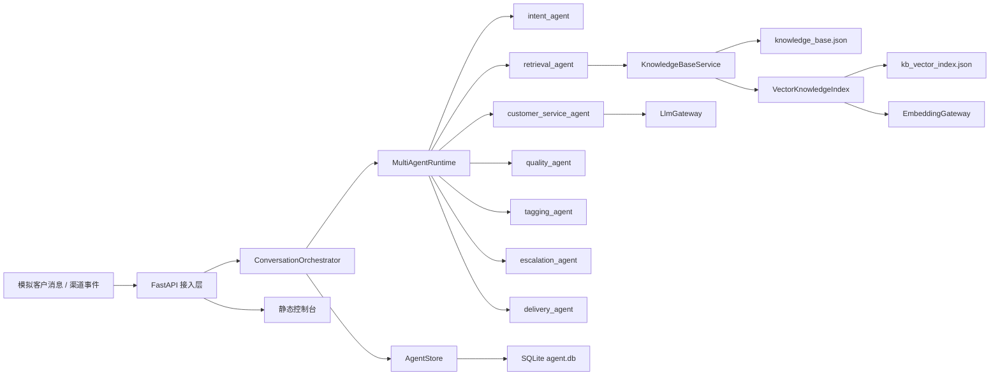

# 商家客服 Agent 中台

> 一个面向商家客服场景的本地可运行 Agent 中台示例，围绕“意图识别 -> 知识检索 -> 回复生成 -> 质量校验 -> 人工跟进”构建完整闭环，并提供可直接演示的 Web 控制台。

---

## 目录

- [项目概览](#项目概览)
- [系统架构](#系统架构)
- [技术栈](#技术栈)
- [项目结构](#项目结构)
- [核心模块详解](#核心模块详解)
  - [main.py - FastAPI 入口与中台接口](#mainpy---fastapi-入口与中台接口)
  - [orchestrator.py - 会话编排主链路](#orchestratorpy---会话编排主链路)
  - [multi_agent.py - 多 Agent 工作流](#multi_agentpy---多-agent-工作流)
  - [intent.py - 意图识别服务](#intentpy---意图识别服务)
  - [knowledge_base.py - 知识库检索与导入](#knowledge_basepy---知识库检索与导入)
  - [vector_store.py + embedding_gateway.py - 轻量 RAG 向量层](#vector_storepy--embedding_gatewaypy---轻量-rag-向量层)
  - [reply.py + llm_gateway.py - 回复生成与模型网关](#replypy--llm_gatewaypy---回复生成与模型网关)
  - [quality.py - 回复质检服务](#qualitypy---回复质检服务)
  - [tagging.py - 标签与升级策略](#taggingpy---标签与升级策略)
  - [store.py - 会话、任务与配置存储](#storepy---会话任务与配置存储)
  - [static/index.html + app.js - 可视化运营控制台](#staticindexhtml--appjs---可视化运营控制台)
- [数据流全景](#数据流全景)
- [设计模式](#设计模式)
- [快速开始](#快速开始)
- [主要接口](#主要接口)
- [当前实现说明](#当前实现说明)

---

## 项目概览

这个项目实现了一套面向商家客服场景的 Agent 中台。它不是一个只负责“直接回复用户”的聊天接口，而是一条具备业务约束、知识约束、质量校验和人工兜底能力的客服处理链路。


当前项目覆盖的核心能力包括：

| 能力 | 说明 |
|------|------|
| 意图识别 | 识别售前咨询、催发货、售后、退换货、价格咨询、其他等场景 |
| 多 Agent 编排 | 基于 LangGraph Supervisor 流程编排多个角色 Agent 完成客服处理 |
| 知识检索 | 按店铺、商品、意图范围检索 FAQ、物流规则、售后政策等知识 |
| 轻量 RAG | 支持关键词检索 + 向量相似度融合召回，具备本地向量索引重建能力 |
| 回复生成 | 基于意图、历史上下文、知识命中和运行时策略生成客服回复 |
| 风险质检 | 拦截承诺性表达、敏感场景乱答、无知识支撑自动回复等风险 |
| 标签体系 | 自动打上低置信度识别、知识未命中、高风险会话、情绪激动等标签 |
| 人工跟进 | 对需升级会话自动创建 follow-up task，支持领取、处理、人工回复 |
| 会话留痕 | 消息、意图、知识命中、回复、质检、任务全链路入库 |
| 中台界面 | 提供聊天模拟、Agent Trace、知识导入、队列管理、配置中心、会话回放 |

项目当前同时具备两种“Agent”特征：

1. **工作流式 Agent**：由统一编排层协调识别、检索、生成、质检和交付。
2. **多角色 Agent**：内部使用 `intent_agent`、`retrieval_agent`、`customer_service_agent`、`quality_agent`、`tagging_agent`、`escalation_agent`、`delivery_agent` 等角色协作完成一次客服处理。

它同时也用到了 **轻量 RAG 思路**：

- 先检索知识，再让回复模块生成内容；
- 检索层支持关键词匹配和 embedding 向量召回；
- 但当前仍是本地 MVP，尚未引入更完整的 chunking、rerank 和独立向量数据库。

---

## 系统架构



**架构特点：**

1. **单体式 MVP**：后端、前端、知识库导入、任务队列和配置中心都在一个项目里，适合本地演示和快速迭代。
2. **Supervisor 多 Agent 流程**：一次客服处理并非单函数调用，而是通过角色 Agent 顺序接力完成。
3. **先检索后生成**：回复生成明确依赖知识命中结果，避免模型脱离业务规则直接回答敏感问题。
4. **生成前后双重约束**：生成前用 Prompt 和知识范围约束，生成后再用 `QualityService` 做确定性质检。
5. **可运营、可审计**：会话详情、任务队列、指标面板、知识导入和系统配置全部可视化。

---

## 技术栈

| 层级 | 技术 | 说明 |
|------|------|------|
| 后端框架 | FastAPI | 提供 API、流式接口、静态页面承载 |
| Agent 编排 | LangGraph | 构建 supervisor 多角色 Agent 工作流 |
| LLM 抽象 | langchain-core / langchain-openai | 支撑消息模型、图节点与 OpenAI 兼容调用 |
| 数据校验 | Pydantic | 统一请求、响应与内部数据模型 |
| 模型调用 | OpenAI 兼容 Chat Completions | 回复生成依赖外部 LLM 服务 |
| Embedding | OpenAI 兼容 Embeddings API | 用于轻量向量索引构建与语义检索 |
| 本地存储 | SQLite | 存储会话、消息、回复、质检、任务和配置 |
| 知识存储 | JSON + CSV | 知识库以 JSON 落盘，支持 CSV 导入 |
| 前端 | HTML + CSS + Vanilla JS | 构建中台控制台，无额外前端工程 |
| HTTP 客户端 | httpx | 异步调用外部 LLM / Embedding 接口 |
| 运行环境 | Python 3.10+ | 支持异步 API、类型标注与本地开发 |

---

## 项目结构

```text
reply-agent/
├─ app/
│  ├─ core/
│  │  ├─ config.py              # 环境变量、Prompt 配置、风险词、Embedding 配置
│  │  └─ database.py            # SQLite 初始化与表结构创建
│  ├─ models/
│  │  └─ schemas.py             # Pydantic 数据模型
│  ├─ services/
│  │  ├─ embedding_gateway.py   # Embedding 接口封装
│  │  ├─ intent.py              # 意图识别
│  │  ├─ knowledge_base.py      # 知识库导入、读取、检索
│  │  ├─ llm_gateway.py         # OpenAI 兼容模型网关
│  │  ├─ multi_agent.py         # LangGraph Supervisor 多 Agent 流程
│  │  ├─ orchestrator.py        # 会话主编排器
│  │  ├─ quality.py             # 回复质检
│  │  ├─ reply.py               # 回复生成
│  │  ├─ store.py               # 会话、任务、配置存储
│  │  ├─ tagging.py             # 标签和升级策略
│  │  └─ vector_store.py        # 本地向量索引与语义检索
│  └─ main.py                   # FastAPI 入口
├─ data/
│  ├─ knowledge_base.json       # 当前知识库数据
│  ├─ kb_vector_index.json      # 本地 embedding 索引文件
│  ├─ knowledge_import_sample.csv
│  ├─ multi_shop_knowledge_import.csv
│  └─ real_knowledge_import.csv
├─ static/
│  ├─ index.html                # 中台页面骨架
│  ├─ styles.css                # 控制台样式
│  └─ app.js                    # 页面交互与 API 调用
├─ README.assets/               # README 配图
├─ .env.example
├─ requirements.txt
├─ test_follow_up_queue.py
├─ test_multi_agent_runtime.py
└─ README.md
```

---

## 核心模块详解

### main.py - FastAPI 入口与中台接口

`app/main.py` 是系统统一入口，主要承担四类职责：

1. 初始化数据库和系统默认配置；
2. 暴露客服处理、知识库、会话、任务、配置和 Dashboard 接口；
3. 提供流式消息处理接口；
4. 直接托管静态控制台页面。

几个关键接口分别对应页面中的主要能力：

- `POST /api/channel/xiaohongshu/events`
  处理一次完整消息事件
- `POST /api/channel/xiaohongshu/events/stream`
  用于 `LIVE CHAT DEMO` 的流式消息演示
- `POST /internal/agent/trace-preview`
  预览多 Agent 的完整处理链路
- `POST /api/knowledge-base/import`
  导入 CSV 知识库
- `POST /api/knowledge-base/vector-index/rebuild`
  重建本地向量索引
- `GET /api/dashboard/metrics`
  驱动首页指标卡片
- `GET /api/follow-up/tasks`
  获取待跟进任务
- `PATCH /api/system/config`
  保存系统运行策略

首页 `/` 会返回 `static/index.html`，并带上资源版本号参数，便于前端静态资源刷新。

---

### orchestrator.py - 会话编排主链路

`app/services/orchestrator.py` 是业务层主调度器。

它负责：

1. 校验当前是否具备 LLM 运行能力；
2. 创建或恢复会话；
3. 先落库用户消息；
4. 调用 `MultiAgentRuntime` 执行完整 Agent 流程；
5. 把意图、知识命中、回复、质检、标签和 follow-up 任务结果统一落库；
6. 返回前端可直接消费的 `ProcessedEventResponse`。

这一层的价值在于：把“外部 API 入口”和“内部多 Agent 细节”隔离开，对外仍然表现成一个稳定的客服中台服务。

---

### multi_agent.py - 多 Agent 工作流

`app/services/multi_agent.py` 是当前项目最像“Agent 系统”的部分。

项目内部通过 LangGraph 定义了一套 **Supervisor 驱动的多角色 Agent 流程**，包含：

- `intent_agent`
- `retrieval_agent`
- `customer_service_agent`
- `quality_agent`
- `tagging_agent`
- `escalation_agent`
- `delivery_agent`

还有一个负责统一规划与路由的：

- `supervisor_agent`

整体流程大致是：

```text
supervisor_agent
  -> intent_agent
  -> retrieval_agent
  -> customer_service_agent
  -> quality_agent
  -> tagging_agent
  -> escalation_agent
  -> delivery_agent
  -> end
```

每个角色都有自己的：

- `role`
- `instructions`
- `tools`
- `can_handoff_to`
- 是否使用 LLM

这使项目从“单次链式调用”升级成了“角色分工明确的多 Agent 工作流”。

当前实现里，Supervisor 并不是完全自由推理式的动态规划器，而是一个 **确定性、可解释、便于前端展示的多 Agent 工作流控制器**。这非常适合中台和演示场景。

---

### intent.py - 意图识别服务

`app/services/intent.py` 实现了意图识别能力。

当前主要基于：

- 关键词规则
- 订单状态上下文
- 风险词信号
- 商品咨询相关线索

输出结构化结果：

```json
{
  "intent": "催发货",
  "confidence": 0.91,
  "signals": ["命中发货关键词", "订单已支付"],
  "needs_human": false
}
```

这个结构化结果会继续驱动：

- 检索范围选择
- 回复 Prompt 选择
- 人工升级策略
- 页面中的 Agent Trace 展示

---

### knowledge_base.py - 知识库检索与导入

`app/services/knowledge_base.py` 负责两件事：

1. 管理知识库数据的导入、保存、列举；
2. 执行知识检索。

知识条目以扁平结构存储，核心字段包括：

- `id`
- `kb_type`
- `shop_id`
- `product_id`
- `intent_scope`
- `title`
- `content`
- `source_name`
- `source_url`

它支持两种检索方式：

- `search_lexical()`：规则过滤 + 关键词打分
- `search()`：关键词分数 + 向量分数 + 业务规则分数的融合召回

检索前会先做业务边界过滤：

- 店铺隔离
- 意图范围过滤
- 商品范围过滤

所以即使引入向量检索，也不会绕过商家和商品边界。

控制台中的 `KNOWLEDGE BASE` 区域允许直接上传 CSV 文件，后端会：

1. 校验表头；
2. 过滤空行和重复 ID；
3. 追加保存到 `data/knowledge_base.json`；
4. 清理旧向量索引；
5. 允许后续手动重建向量索引。

---

### vector_store.py + embedding_gateway.py - 轻量 RAG 向量层

这是项目里和 RAG 最相关的部分。

#### embedding_gateway.py

`app/services/embedding_gateway.py` 负责调用 OpenAI 兼容 Embeddings API，把文本转为向量。

特征：

- 通过 `EMBEDDING_API_KEY` 判断是否启用；
- 支持自定义 `EMBEDDING_BASE_URL`；
- 统一做向量归一化，便于后续相似度计算。

#### vector_store.py

`app/services/vector_store.py` 提供本地向量索引能力：

- 把知识文档转成 embedding；
- 存储到 `data/kb_vector_index.json`；
- 按文档签名判断是否需要重建；
- 在查询时对候选知识做向量相似度排序。

当前 RAG 形态可以概括为：

```text
知识库文档
  -> 文本拼接
  -> Embedding
  -> 本地 JSON 向量索引
  -> 查询向量化
  -> 候选文档相似度排序
  -> 与关键词分数融合
  -> 返回 Top-K 命中结果
```

它是 **轻量版 RAG**，已经具备 Retrieve + Generate 的基本链路，但还没有：

- 独立向量数据库
- chunk 切分流水线
- rerank 模型
- 检索评测体系

所以更准确的描述是：**项目已经使用了轻量 RAG 技术，并为后续完整 RAG 升级预留了结构。**

---

### reply.py + llm_gateway.py - 回复生成与模型网关

`app/services/reply.py` 根据意图选择 Prompt 模板，`app/services/llm_gateway.py` 负责实际调用外部 LLM。

回复生成输入会拼入：

- 当前意图
- 对应意图的回复约束
- 近几轮会话历史
- 知识库命中内容
- 用户最新消息

输出结构包括：

- `draft_reply`
- `prompt_template`
- `cited_knowledge_ids`
- `risk_notes`
- `model_name`

`LlmGateway` 使用 OpenAI 兼容的 `chat/completions` 接口，因此可以接：

- OpenAI
- 兼容 OpenAI 协议的第三方模型服务

当前版本中，LLM 是必需运行组件；如果没有配置 `LLM_API_KEY`，消息处理接口会直接返回不可用错误。

---

### quality.py - 回复质检服务

`app/services/quality.py` 负责判断一条回复是否可以安全发送。

当前质检重点包括：

- 是否出现承诺性表达
- 敏感意图下是否缺少知识支撑
- 售后/退换货类回复是否缺少平台审核或售后入口引导
- 发货类回复是否出现具体到达时间承诺

质检输出包括：

- `passed`
- `risk_level`
- `issues`
- `suggestion`
- `review_mode`

这使系统具备“模型生成之后仍有规则守门”的能力。

---

### tagging.py - 标签与升级策略

`app/services/tagging.py` 用来汇总风险信号并决定是否升级人工。

它综合以下维度：

- 意图识别置信度
- 质检结果
- 知识命中数量
- 风险关键词
- 用户情绪关键词

可能生成的标签包括：

- `低置信度识别`
- `知识未命中`
- `高风险会话`
- `高风险售后`
- `情绪激动`
- `时效敏感`

这些标签会继续影响：

- 是否进入 follow-up 队列
- 任务优先级 `P1 / P2 / P3`
- 控制台中的会话高亮和过滤

---

### store.py - 会话、任务与配置存储

`app/services/store.py` 是系统的持久化核心，统一封装了：

- 会话与消息
- 意图结果
- 知识命中
- 回复记录
- 质检结果
- 标签
- follow-up 任务
- 系统配置

它不只是简单 CRUD，还承担了一些运维修复能力：

- 自动补全历史任务缺失的 `message_id`
- 恢复丢失的 follow-up 任务
- 清理重复任务
- 清空未处理任务
- 支持人工回复后关闭任务
- 汇总仪表盘指标

因此，它既是数据仓储层，也是当前 MVP 的“运营数据中心”。

---

### static/index.html + app.js - 可视化运营控制台

前端使用原生 HTML、CSS、JavaScript 构建。

控制台主要由以下几块构成：

| 区域 | 对应能力 |
|------|----------|
| `LIVE CHAT DEMO` | 模拟客户消息，实时展示 Agent 回复 |
| `AGENT TRACE` | 展示本轮意图识别、知识命中、回复、质检、handoff 决策 |
| `KNOWLEDGE BASE` | CSV 导入与知识预览 |
| `FOLLOW-UP QUEUE` | 待跟进任务查看与处理 |
| `SYSTEM CONFIG` | 自动回复、模型配置、阈值、风险词配置 |
| `CONVERSATIONS` | 最近会话列表、会话详情、标签和回复记录 |

`static/app.js` 里几个值得关注的点：

- 使用 `fetch` 对接全部 API；
- 使用 SSE 风格读取 `/api/channel/xiaohongshu/events/stream`；
- 维护页面级状态，如当前会话、最近仿真结果、聊天消息列表；
- 支持一键注入演示数据；
- 支持上传知识库 CSV；
- 支持保存运行策略。

这一层让项目不只是“后端服务”，而是一个能完整展示 Agent 中台价值的可交互演示系统。

---

## 数据流全景

```text
模拟客户输入消息
    |
    v
POST /api/channel/xiaohongshu/events/stream
    |
    v
ConversationOrchestrator
    |
    v
MultiAgentRuntime / LangGraphMultiAgentSystem
    |
    +--> supervisor_agent
    |      规划角色执行顺序，生成 agent_plan
    |
    +--> intent_agent
    |      识别意图、置信度和人工介入信号
    |
    +--> retrieval_agent
    |      关键词检索 + 向量检索融合召回知识
    |
    +--> customer_service_agent
    |      基于知识和上下文生成客服回复
    |
    +--> quality_agent
    |      做承诺风险、知识缺失、政策边界检查
    |
    +--> tagging_agent
    |      生成运营标签
    |
    +--> escalation_agent
    |      决定自动回复还是人工跟进
    |
    +--> delivery_agent
           输出最终回复、状态和 follow-up 元数据
    |
    v
AgentStore
    |
    +--> 写入 conversations / messages / intents / hits / replies / qc / tags / tasks
    |
    v
前端控制台实时展示：
- 聊天气泡
- Agent Trace
- 最近会话
- Follow-up 队列
- Dashboard 指标
```

---

## 设计模式

| 模式 | 应用位置 | 说明 |
|------|---------|------|
| 门面模式 | `ConversationOrchestrator` | 对外暴露统一处理入口，隐藏内部多 Agent 流程细节 |
| Supervisor 模式 | `LangGraphMultiAgentSystem` | 由 `supervisor_agent` 协调多个角色 Agent 执行顺序 |
| 策略模式 | `config.py` 中 Prompt 与质检配置 | 不同意图使用不同回复策略与风控约束 |
| 仓储模式 | `AgentStore` | 统一封装 SQLite 数据读写和聚合查询 |
| 管道式处理 | 客服主链路 | 识别、检索、生成、质检、升级按顺序推进 |
| 缓存模式 | `load_knowledge_base()` | 知识库内容本地缓存，减少重复读取 |
| 轻量 RAG 融合模式 | `KnowledgeBaseService.search()` | 关键词分数、向量分数和业务规则分数融合召回 |

---

## 快速开始

### 1. 安装依赖

```powershell
pip install -r requirements.txt
```

### 2. 配置环境变量

参考 [.env.example](/D:/study/agent/codex/reply-agent/.env.example) 在项目根目录创建 `.env`：

```env
LLM_API_KEY=
LLM_BASE_URL=https://api.openai.com/v1
LLM_MODEL=gpt-4.1-mini

EMBEDDING_API_KEY=
EMBEDDING_BASE_URL=https://api.openai.com/v1
EMBEDDING_MODEL=text-embedding-3-small
```

说明：

- `LLM_API_KEY` 必填；否则客服消息处理和 Agent Trace 无法正常运行。
- `EMBEDDING_API_KEY` 可选；不配置时项目仍可运行，但只使用关键词检索，不启用向量召回。
- 如果你接的是兼容 OpenAI 协议的第三方模型服务，也可以修改 `LLM_BASE_URL` 和 `EMBEDDING_BASE_URL`。

### 3. 启动服务

```powershell
python -m uvicorn app.main:app --reload
```

启动后访问：

- 控制台首页：`http://127.0.0.1:8000/`
- Swagger 文档：`http://127.0.0.1:8000/docs`
- 健康检查：`http://127.0.0.1:8000/health`

### 4. 推荐演示顺序

1. 打开首页，先查看 Dashboard、知识库和最近会话。
2. 在 `LIVE CHAT DEMO` 中输入一条售前、发货或售后问题。
3. 观察右侧 `AGENT TRACE` 中的识别、检索、回复和 handoff 决策。
4. 到 `FOLLOW-UP QUEUE` 查看高风险任务是否入队。
5. 到 `SYSTEM CONFIG` 中调整自动回复开关或阈值。
6. 用 `KNOWLEDGE BASE` 上传 CSV，再重建向量索引验证召回变化。

---

## 主要接口

### 对外演示接口

- `GET /`
  返回中台首页
- `GET /health`
  健康检查
- `POST /api/channel/xiaohongshu/events`
  处理一次完整消息事件
- `POST /api/channel/xiaohongshu/events/stream`
  流式返回消息处理过程

### Agent 预览接口

- `POST /internal/agent/trace-preview`
  不落库预览一次完整多 Agent 处理过程，返回 `agent_plan` 和 `agent_trace`

### 知识库接口

- `GET /api/knowledge-base`
  列出当前知识条目
- `POST /api/knowledge-base/import`
  导入 CSV 知识库
- `POST /api/knowledge-base/vector-index/rebuild`
  重建向量索引

### 会话与任务接口

- `GET /api/conversations`
  获取最近会话列表
- `GET /api/conversations/{conversation_id}`
  获取单个会话详情
- `DELETE /api/conversations/{conversation_id}`
  删除会话及关联记录
- `GET /api/follow-up/tasks`
  获取待跟进任务列表
- `GET /api/follow-up/tasks/{task_id}`
  获取任务详情
- `POST /api/follow-up/tasks/{task_id}/claim`
  领取任务
- `POST /api/follow-up/tasks/{task_id}/resolve`
  标记任务已处理
- `POST /api/follow-up/tasks/{task_id}/manual-reply`
  通过人工回复处理任务
- `POST /api/follow-up/tasks/cleanup`
  清理重复任务
- `POST /api/follow-up/tasks/clear-open`
  清空未处理任务

### 配置与指标接口

- `GET /api/dashboard/metrics`
  获取仪表盘指标
- `GET /api/system/config`
  获取系统配置
- `PATCH /api/system/config`
  更新系统配置

### 内部能力接口

- `POST /internal/intent/recognize`
  单独调用意图识别
- `POST /internal/kb/search`
  单独调用知识检索
- `POST /internal/reply/generate`
  单独调用回复生成
- `POST /internal/reply/check`
  单独调用回复质检

---

## 当前实现说明

- 这是一个强调“可运行、可演示、可观察”的 Agent 中台 MVP。
- 项目已经具备 **多 Agent 工作流**，不再只是单一链式调用。
- 项目已经使用 **轻量 RAG**：
  - 支持知识检索先行；
  - 支持 embedding 向量召回；
  - 支持关键词与语义分数融合。
- 当前回复生成依赖外部 LLM 服务，未提供完全离线回复模式。
- 存储层采用 SQLite，适合单机演示和本地验证；若要进入生产，建议拆分数据库、检索服务和配置中心。
- 向量能力当前以本地 JSON 索引实现，适合 MVP；如果继续演进，可升级到 pgvector、Milvus、Elasticsearch 或其他向量数据库。
- 当前质检层仍以规则为主，后续可以继续补充：
  - LLM 评审器
  - rerank
  - 检索效果评测
  - Prompt A/B 测试
  - 多店铺品牌语气配置

如果后续继续演进，比较自然的方向是：

- 引入更强的意图分类模型；
- 把轻量 RAG 升级为完整的向量检索 + rerank 体系；
- 把多 Agent 的决策路径做成更强的可视化链路；
- 增加人工处理结果回流，用于优化 Prompt、检索和质检规则。
