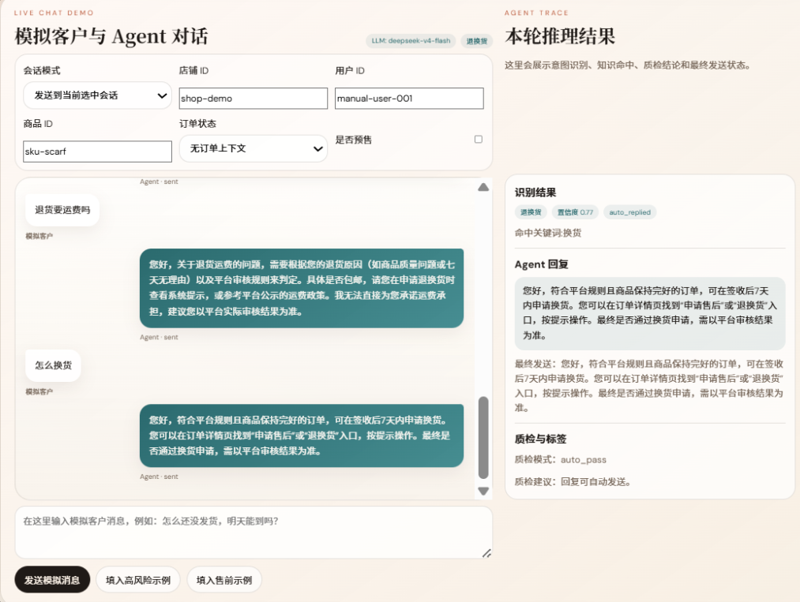
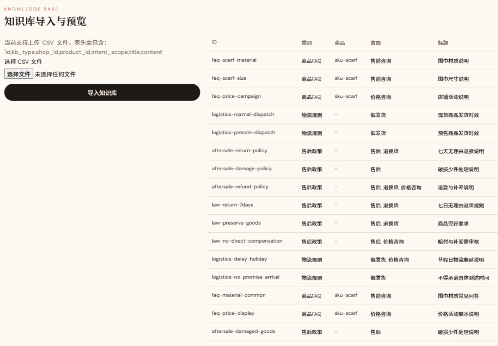
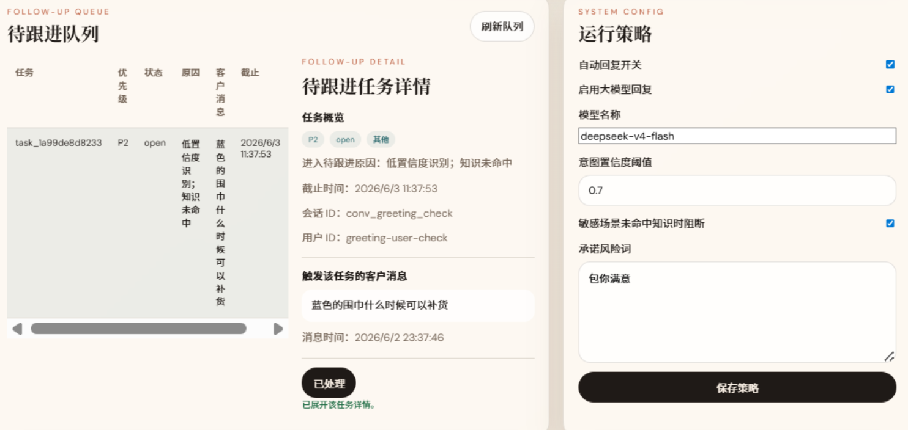
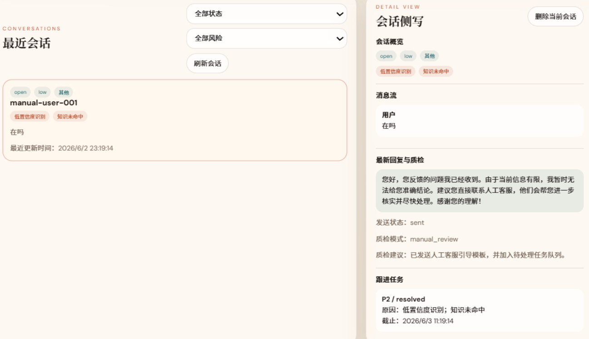
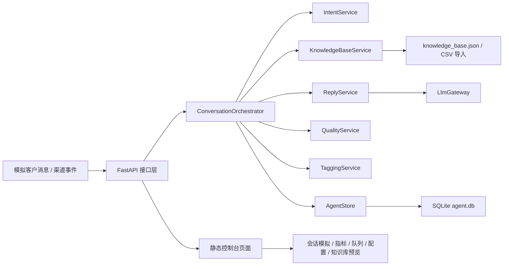

# 商家客服 Agent 中台 

> 一个面向商家客服场景的本地可运行 Agent 中台示例，围绕“意图识别 -> 知识检索 -> 回复生成 -> 质检拦截 -> 待跟进流转”构建完整闭环，并提供可直接演示的 Web 控制台。

---

## 目录

- [项目概览](#项目概览)
- [系统架构](#系统架构)
- [技术栈](#技术栈)
- [项目结构](#项目结构)
- [核心模块详解](#核心模块详解)
  - [main.py - FastAPI 入口与中台接口](#mainpy---fastapi-入口与中台接口)
  - [orchestrator.py - 会话编排主链路](#orchestratorpy---会话编排主链路)
  - [intent.py - 意图识别服务](#intentpy---意图识别服务)
  - [knowledge_base.py - 知识库检索与导入](#knowledge_basepy---知识库检索与导入)
  - [reply.py + llm_gateway.py - 回复生成与模型网关](#replypy--llm_gatewaypy---回复生成与模型网关)
  - [quality.py - 回复质检服务](#qualitypy---回复质检服务)
  - [tagging.py - 标签与任务升级策略](#taggingpy---标签与任务升级策略)
  - [store.py - 会话、任务与配置存储](#storepy---会话任务与配置存储)
  - [static/index.html + app.js - 可视化运营控制台](#staticindexhtml--appjs---可视化运营控制台)
- [数据流全景](#数据流全景)
- [设计模式](#设计模式)
- [快速开始](#快速开始)
- [主要接口](#主要接口)
- [当前实现说明](#当前实现说明)


## 项目概览

这个项目实现了一套面向商家客服场景的 Agent 中台。它不是一个只会“自动回复”的聊天机器人，而是一套强调可控、可追踪、可接管的客服处理链路。









当前项目覆盖的核心能力包括：

| 能力 | 说明 |
|------|------|
| 意图识别 | 识别售前咨询、催发货、售后、退换货、价格咨询、其他等场景 |
| 知识检索 | 按商品 FAQ、物流规则、售后政策等知识源检索命中内容 |
| 回复生成 | 基于意图、历史上下文和知识命中生成草稿回复 |
| 风险质检 | 拦截承诺性表达、敏感场景乱答、知识缺失时误发等问题 |
| 标签体系 | 自动打上低置信度识别、知识未命中、高风险等标签 |
| 待跟进队列 | 对高风险或需人工接管的会话生成待处理任务 |
| 会话留痕 | 消息、意图、知识命中、回复、质检、任务全链路入库 |
| 中台界面 | 提供可视化控制台，支持演示、导入知识、查看队列、调整策略 |

这版界面已经包含你截图里展示的几块核心工作区：

- `LIVE CHAT DEMO`：模拟客户发消息，实时观察 Agent 回复和推理结果
- `KNOWLEDGE BASE`：上传 CSV 并预览当前知识条目
- `FOLLOW-UP QUEUE`：查看待跟进任务并标记处理完成
- `SYSTEM CONFIG`：调整自动回复、模型开关、质检阈值和风险词
- `CONVERSATIONS`：查看近期会话、标签、回复和跟进详情

---

## 系统架构



**架构特点：**

1. **单体式 MVP 架构**：后端、页面、规则、知识库导入都在一个 FastAPI 工程里，便于本地演示和快速验证。
2. **编排式处理链路**：所有消息统一进入 `ConversationOrchestrator`，依次完成识别、检索、生成、质检、打标和入队。
3. **规则优先，模型可选增强**：默认可不依赖真实大模型运行；只有在配置了 `LLM_API_KEY` 且后台开启开关时才走模型生成。
4. **数据与运营一体化**：会话明细、待跟进任务、系统配置、知识库导入都可在同一套本地中台界面中完成。

---

## 技术栈

| 层级 | 技术 | 说明 |
|------|------|------|
| 后端框架 | FastAPI | 提供 API、流式事件接口和静态页面承载 |
| 数据校验 | Pydantic | 统一请求、响应和内部数据模型 |
| 本地存储 | SQLite | 存储会话、消息、回复、质检、任务和系统配置 |
| 知识存储 | JSON + CSV | 知识库以 JSON 落盘，支持 CSV 增量导入 |
| 前端 | HTML + CSS + Vanilla JS | 构建中台演示控制台，无额外前端工程 |
| 模型调用 | OpenAI 兼容 Chat Completions | 通过 `LLM_BASE_URL` + `LLM_API_KEY` 接入兼容模型 |
| HTTP 客户端 | httpx | 异步调用外部 LLM 接口 |
| 运行环境 | Python 3.10+ | 适合本地开发、演示和快速验证 |

---

## 项目结构

```text
reply-agent/
├─ app/
│  ├─ core/
│  │  ├─ config.py          # 环境变量、Prompt 配置、风险词与默认策略
│  │  └─ database.py        # SQLite 初始化与表结构创建
│  ├─ models/
│  │  └─ schemas.py         # Pydantic 数据模型
│  ├─ services/
│  │  ├─ demo.py            # 演示数据与场景生成
│  │  ├─ intent.py          # 意图识别
│  │  ├─ knowledge_base.py  # 知识库导入、读取、检索
│  │  ├─ llm_gateway.py     # OpenAI 兼容模型网关
│  │  ├─ orchestrator.py    # 主链路编排
│  │  ├─ quality.py         # 回复质检
│  │  ├─ reply.py           # 回复生成
│  │  ├─ store.py           # 会话、任务、配置读写
│  │  └─ tagging.py         # 标签和升级逻辑
│  └─ main.py               # FastAPI 入口
├─ data/
│  ├─ knowledge_base.json   # 当前知识库数据
│  ├─ knowledge_import_sample.csv
│  └─ real_knowledge_import.csv
├─ static/
│  ├─ index.html            # 中台页面骨架
│  ├─ styles.css            # 控制台样式
│  └─ app.js                # 页面交互与 API 调用
├─ .env.example             # LLM 配置示例
├─ ARCHITECTURE.md          # 架构设计说明
├─ requirements.txt
└─ README.md
```

---

## 核心模块详解

### main.py - FastAPI 入口与中台接口

`app/main.py` 是整个项目的统一入口，承担三类职责：

- 初始化数据库与默认系统配置
- 暴露客服处理中台相关 API
- 直接托管静态控制台页面

其中几个关键接口分别对应截图中的页面能力：

- `POST /api/channel/xiaohongshu/events/stream`
  负责会话模拟区的流式回复演示
- `GET /api/dashboard/metrics`
  驱动首页指标卡片
- `GET /api/follow-up/tasks`
  驱动待跟进队列
- `GET /api/conversations`
  驱动最近会话列表
- `PATCH /api/system/config`
  保存运行策略
- `POST /api/knowledge-base/import`
  处理 CSV 知识库导入

项目首页 `/` 会直接返回 `static/index.html`，因此启动服务后即可打开一个完整的演示控制台。

---

### orchestrator.py - 会话编排主链路

`app/services/orchestrator.py` 是这套 MVP 的核心调度器。

它把一次用户消息处理拆成固定步骤：

1. 写入用户消息与会话上下文
2. 调用 `IntentService` 做意图识别
3. 调用 `KnowledgeBaseService` 检索知识
4. 调用 `ReplyService` 生成回复草稿
5. 调用 `QualityService` 进行质检
6. 调用 `TaggingService` 生成标签并判断是否升级
7. 根据策略决定自动发送、阻断发送或转人工跟进
8. 把结果写回 `AgentStore`

这让整个项目具备了明确的“可控链路”，而不是单次问答式黑盒调用。

---

### intent.py - 意图识别服务

`app/services/intent.py` 当前实现的是规则优先的轻量意图识别服务。

它会结合：

- 消息中的关键词
- 订单状态上下文
- 问题语义特征

输出标准化结果：

```json
{
  "intent": "催发货",
  "confidence": 0.77,
  "signals": ["提到发货时效", "订单状态为 paid"]
}
```

这类结构化结果会继续驱动后续的知识检索、回复模板选择和风险升级判断。

---

### knowledge_base.py - 知识库检索与导入

`app/services/knowledge_base.py` 负责两件事：

- 管理知识库导入、保存与预览
- 基于当前问题进行知识检索

当前知识条目采用扁平结构，支持字段：

- `id`
- `kb_type`
- `shop_id`
- `product_id`
- `intent_scope`
- `title`
- `content`

控制台中的 `KNOWLEDGE BASE` 区域允许直接上传 CSV 文件，后端会：

1. 读取 CSV 内容
2. 校验表头
3. 转成内部知识条目
4. 保存到 `data/knowledge_base.json`
5. 立即刷新前端预览表格

当前检索更偏向规则过滤和关键词匹配，适合做 MVP 演示；后续可以很自然升级为 BM25、向量检索与重排。

---

### reply.py + llm_gateway.py - 回复生成与模型网关

`app/services/reply.py` 负责按意图组装回复逻辑，`app/services/llm_gateway.py` 负责可选的大模型调用。

项目当前支持两种模式：

- **模板模式**：默认模式，不依赖外部模型也可以运行完整流程
- **LLM 模式**：在系统配置中开启 `llm_enabled`，且本地存在 `LLM_API_KEY` 时，调用兼容 OpenAI Chat Completions 的模型生成回复

模型请求中会拼入：

- 当前意图
- 对应意图的回复约束
- 最近几轮历史会话
- 当前知识命中内容
- 用户最新问题

因此模型并不是自由发挥，而是在较强约束下做表达增强。

---

### quality.py - 回复质检服务

`app/services/quality.py` 用来判断一条回复是否可以安全发送。

当前质检重点包括：

- 是否出现承诺性表达
- 是否在敏感意图下没有命中知识却仍然尝试强答
- 是否存在售后、赔付、时效类越权表述

质检结果会输出：

- `pass`
- `risk_level`
- `review_mode`
- `suggestion`

如果质检失败，消息不会自动发送，而是进入待跟进链路。

---

### tagging.py - 标签与任务升级策略

`app/services/tagging.py` 是会话“风险信号”的聚合层。

它会结合：

- 意图识别置信度
- 质检结果
- 知识是否命中
- 消息中的高风险词、情绪词

生成诸如下面的标签：

- `低置信度识别`
- `知识未命中`
- `高风险售后`
- `情绪激动`

并进一步判断：

- 是否需要进入待跟进队列
- 任务优先级应为 `P1` / `P2`

这正是截图中 `FOLLOW-UP QUEUE` 和 `会话侧写` 区域的来源。

---

### store.py - 会话、任务与配置存储

`app/services/store.py` 是当前 MVP 最重的基础模块，负责持久化几乎所有业务状态：

- 会话与消息
- 意图识别结果
- 知识命中记录
- 回复记录
- 质检结果
- 标签
- 待跟进任务
- 系统运行配置

它还提供了若干非常实用的运营能力：

- 自动补齐缺失的任务关联消息
- 恢复应存在但未生成的跟进任务
- 清理重复任务
- 清理开放任务
- 删除完整会话
- 聚合仪表盘指标

也正因为这些能力，页面才能直接支持“最近会话”“指标卡”“队列详情”“策略配置”这些中台操作。

---

### static/index.html + app.js - 可视化运营控制台

前端不依赖 React、Vue 这类框架，而是使用原生 HTML/CSS/JavaScript 实现了一个完整的演示控制台。

控制台包含以下几个主要区域：

| 区域 | 对应能力 |
|------|----------|
| `LIVE CHAT DEMO` | 模拟真实客户消息，走完整处理链路，并展示流式回复 |
| `AGENT TRACE` | 展示本轮意图识别、知识命中、质检建议和最终发送结果 |
| `KNOWLEDGE BASE` | 上传 CSV、查看知识条目 |
| `FOLLOW-UP QUEUE` | 浏览待跟进任务，查看详情并标记已处理 |
| `SYSTEM CONFIG` | 配置自动回复、模型开关、阈值和风险词 |
| `CONVERSATIONS` | 查看最近会话、标签、最新回复和跟进情况 |

`static/app.js` 里几个值得关注的设计点：

- 使用 `fetch` 对接全部 API
- 使用 SSE 风格流式读取 `/api/channel/xiaohongshu/events/stream`
- 在浏览器中维护会话与任务的轻量状态
- 支持一键灌入演示数据和典型场景

如果你要继续扩展前端，这一层就是最直接的切入点。

---

## 数据流全景

```text
模拟客户输入消息
    |
    v
POST /api/channel/xiaohongshu/events/stream
    |
    v
ConversationOrchestrator
    |
    +--> IntentService
    |      识别意图 + 置信度 + 触发信号
    |
    +--> KnowledgeBaseService
    |      检索 FAQ / 物流 / 售后知识
    |
    +--> ReplyService
    |      模板生成 or LLM 生成回复草稿
    |
    +--> QualityService
    |      质检通过 / 拦截 / 给出建议
    |
    +--> TaggingService
    |      打标签 + 判断是否进入跟进队列
    |
    +--> AgentStore
           写入会话、消息、回复、质检、任务、配置
    |
    v
页面实时展示：
- 聊天气泡
- Agent Trace
- 最近会话
- 跟进队列
- 指标卡片
```

---

## 设计模式

| 模式 | 应用位置 | 说明 |
|------|---------|------|
| 门面模式 | `ConversationOrchestrator` | 对外暴露统一处理入口，隐藏内部多服务编排细节 |
| 策略模式 | `config.py` 中的意图 Prompt 与风险规则 | 不同意图走不同回复约束与风控逻辑 |
| 仓储模式 | `AgentStore` | 统一封装 SQLite 数据访问与聚合查询 |
| 管道式处理 | 消息处理主链路 | 识别、检索、生成、质检、打标按顺序推进 |
| 渐进增强 | `ReplyService` + `LlmGateway` | 默认模板可运行，配置模型后再启用生成增强 |

---

## 快速开始

### 1. 安装依赖

```powershell
pip install -r requirements.txt
```

### 2. 配置环境变量

参考 [.env.example](D:/study/agent/codex/reply-agent/.env.example) 在项目根目录创建 `.env`：

```env
LLM_API_KEY=
LLM_BASE_URL=https://api.openai.com/v1
LLM_MODEL=gpt-4.1-mini
```

说明：

- 不填写 `LLM_API_KEY` 也可以运行，系统会自动退回模板模式
- 如果你接的是兼容 OpenAI Chat Completions 的第三方模型，也可以改 `LLM_BASE_URL`
- 模型名会在页面的 `SYSTEM CONFIG` 中继续可调

### 3. 启动服务

```powershell
python -m uvicorn app.main:app --reload
```

启动后访问：

- 控制台首页：`http://127.0.0.1:8000/`
- Swagger 文档：`http://127.0.0.1:8000/docs`
- 健康检查：`http://127.0.0.1:8000/health`

### 4. 推荐演示顺序

1. 打开首页，先点击“重置并灌入演示数据”
2. 在 `LIVE CHAT DEMO` 中发送一条模拟客户消息
3. 观察右侧 `AGENT TRACE` 的识别、回复和质检结果
4. 到 `FOLLOW-UP QUEUE` 看高风险任务是否入队
5. 在 `SYSTEM CONFIG` 中切换自动回复或模型开关
6. 用 `KNOWLEDGE BASE` 上传 CSV 测试知识命中变化

---

## 主要接口

### 对外演示接口

- `GET /`
  返回可视化中台首页
- `GET /health`
  服务健康检查
- `POST /api/channel/xiaohongshu/events`
  处理一次完整消息事件
- `POST /api/channel/xiaohongshu/events/stream`
  流式返回模拟消息处理过程
- `POST /api/demo/seed`
  重置并注入演示数据
- `POST /api/demo/run`
  一键生成典型客服场景

### 中台数据接口

- `GET /api/dashboard/metrics`
  获取仪表盘指标
- `GET /api/conversations`
  获取最近会话列表
- `GET /api/conversations/{conversation_id}`
  获取单个会话详情
- `DELETE /api/conversations/{conversation_id}`
  删除会话及关联记录
- `GET /api/follow-up/tasks`
  获取待跟进队列
- `GET /api/follow-up/tasks/{task_id}`
  获取待跟进任务详情
- `POST /api/follow-up/tasks/{task_id}/claim`
  领取任务
- `POST /api/follow-up/tasks/{task_id}/resolve`
  标记任务已处理
- `POST /api/follow-up/tasks/{task_id}/manual-reply`
  通过人工回复完成任务

### 内部能力接口

- `POST /internal/intent/recognize`
  意图识别
- `POST /internal/kb/search`
  知识检索
- `POST /internal/reply/generate`
  回复生成
- `POST /internal/reply/check`
  回复质检

### 知识与配置接口

- `GET /api/knowledge-base`
  列出当前知识条目
- `POST /api/knowledge-base/import`
  导入 CSV 知识库
- `GET /api/system/config`
  获取系统配置
- `PATCH /api/system/config`
  更新系统配置

---

## 当前实现说明

- 这是一个强调可运行、可演示、可观察的 MVP，适合本地展示客服 Agent 中台的完整处理闭环。
- 当前意图识别、知识检索和质检以规则与轻量逻辑为主，优先保证链路清晰和风险可控。
- 大模型接入已经预留，但属于可选增强；没有 API Key 时系统仍可完整工作。
- 前端控制台已经具备较完整的运营视角，不只是“测试接口页”，而是能真实演示会话、风险和任务流转。
- 存储层采用 SQLite，适合单机验证；如果进入多人协作或生产场景，建议拆分数据库、检索服务和配置中心。
- 页面中对话模拟使用流式返回，能更直观看到 Agent 回复过程，但底层仍然是一次完整的后端编排执行。

如果后续继续演进，比较自然的方向是：

- 接入更强的意图分类模型
- 把知识检索升级为 BM25 + 向量召回 + 重排
- 为不同店铺做独立配置与品牌语气管理
- 增加人工处理记录回流，用于优化规则、Prompt 和知识库
